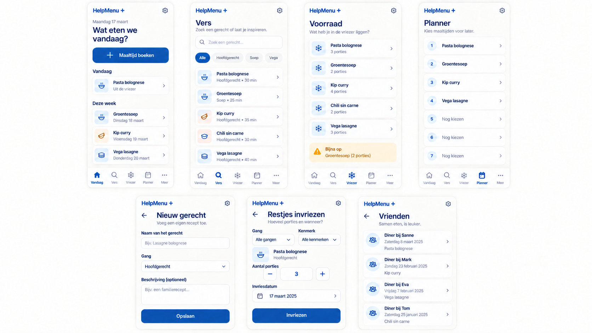

# HelpMenu — Design document

**Versie:** 1.1
**Datum:** 22 september 2026  
**Status:** vastgesteld — gekozen ontwerprichting: **Vandaag eerst**; eerste online release in gebruik.

## 1. Doel en uitgangspunt

HelpMenu is een rustige, persoonlijke app voor twee mensen die samen kiezen wat zij koken, hun vriezer bijhouden en maaltijden plannen. De interface maakt de dagelijkse handeling — *wat eten we vandaag en wat doen we ermee?* — sneller dan het beheren van gegevens.

De gekozen richting is **Vandaag eerst**. De startpagina zet daarom de eerstvolgende praktische actie voorop: een maaltijd boeken, een geplande maaltijd kiezen of restjes invriezen. De voorraadinformatie blijft prominent aanwezig, zodat eten uit de vriezer en het reserveren van porties betrouwbaar voelt.

Dit document beschrijft zeven hoofdschermen:

1. Vandaag
2. Vers
3. Vriezer
4. Planner
5. Nieuw gerecht
6. Restjes invriezen
7. Vrienden

De zes schermen uit het functioneel document blijven dus directe ingangen. **Vandaag** is de vaste startpagina die deze ingangen verbindt.

## Schermvoorbeelden



De afbeelding is een visuele weergave van de gekozen richting. De functionele specificaties en concrete voorbeeldinhoud in [hoofdstuk 5](#5-de-zeven-schermen) blijven leidend wanneer beeld en tekst van elkaar afwijken.

## 2. Ontwerpprincipes

### Dagelijkse actie eerst

Elke hoofdweergave heeft één duidelijke primaire actie. Op Vandaag is dat `Maaltijd boeken`; op Vriezer is dat `Restjes invriezen`; in de Planner is dat `Maaltijd toevoegen`. Secundaire handelingen zijn aanwezig, maar krijgen minder visueel gewicht.

### De echte status is zichtbaar

De app communiceert expliciet of een maaltijd vers wordt gekookt, uit de vriezer komt, gereserveerd is of al is geboekt. Een gebruiker hoeft niet uit kleur of een verborgen menu af te leiden wat er met een portie gebeurt.

### Klein scherm is de basis

De primaire weergave is een telefoon in portretstand. Tablet en desktop bieden meer ademruimte of een tweede kolom, maar veranderen de volgorde van de belangrijkste taak niet. Hierdoor blijft dezelfde app eenvoudig te gebruiken in de keuken, supermarkt en aan tafel.

### Rustig en menselijk

Koele, lichte oppervlakken en een helder diepblauw accent geven de app een rustige, betrouwbare uitstraling zonder de interface decoratief of druk te maken. Foto's zijn optioneel en ondersteunen herkenning; ze zijn nooit nodig om een gerecht of actie te begrijpen.

### Eén registratie, meerdere ingangen

Vers, Vriezer, Planner en Restjes openen allemaal dezelfde boekingsflow. De gebruiker ziet per ingang alleen de passende standaardkeuze, bijvoorbeeld `Gegeten uit de vriezer` wanneer een voorraadregel wordt geopend.

## 3. Visuele taal

### Basistokens

| Onderdeel | Richting | Gebruik |
|---|---|---|
| Hoofdkleur | Helder diepblauw | Primaire knop, actieve navigatie, bevestigde status. |
| Achtergrond | Koel gebroken wit | Hoofdachtergrond en rustige leesruimte. |
| Oppervlak | Wit | Formulieren, maaltijdregels en dialoogvensters. |
| Voorraadaccent | Lichtblauw | Porties, vriesstatus en neutrale voorraadmarkering. |
| Attentie | Zacht amber | Niet-blokkerende melding zoals “eerst opmaken”. |
| Fout/verwijderen | Terughoudend rood | Alleen destructieve acties, validatiefout en herstelbare foutmelding. |

Kleur wordt nooit het enige statusmiddel. Elke status krijgt ook tekst, bijvoorbeeld `1 portie gereserveerd` of `Uit de vriezer`.

### Typografie en componenten

- Gebruik een systeemlettertype of één goed ondersteund webfont; tekst blijft leesbaar zonder geladen font.
- Gebruik gewone tekstgroottes voor inhoud; kleine ondersteunende tekst is nooit kleiner dan 12 px.
- Gebruik afgeronde invoervelden en regels met een duidelijke, maar subtiele scheiding.
- Gebruik herkenbare pictogrammen alleen naast een zichtbare tekstlabel bij primaire acties.
- Toon foto’s in een vaste uitsnede. De knop `Foto toevoegen` gebruikt op telefoon de gewone systeemkiezer; op iPhone kan daarmee de Fotobibliotheek of de camera worden gekozen. Ontbreekt een foto, toon dan een rustig standaardvlak met het gerechtstype; geen lege of kapotte afbeelding.

### Navigatie

Op telefoon staat onderaan een vaste navigatie met vier hoofdpaden: `Vandaag`, `Planner`, `Vriezer` en `Zoeken`. `Zoeken` opent de gerechtenverzameling (Vers) en geeft tevens toegang tot filters. De overige directe ingangen zijn binnen één tik bereikbaar:

- `Nieuw gerecht` staat als actie in Vers en op Vandaag.
- `Restjes invriezen` staat op Vandaag en Vriezer.
- `Vrienden` staat in het profiel-/meer-menu, maar blijft eveneens een directe route zonder tussenstappen.

Op tablet en desktop verandert de onderste balk in een vaste linkerzijbalk met alle zeven schermen zichtbaar. De actie om een maaltijd te boeken blijft bovenaan de inhoud staan.

## 4. Gedeelde interactiepatronen

### Maaltijd boeken

Een tik op `Nu boeken` opent een compact dialoogvenster of, op telefoon, een bottom sheet. Bij een verse maaltijd zijn `Gegeten` en `Ingevroren` onafhankelijke selecties, zodat de gebruiker beide kan kiezen. De invriesvelden voor porties en personen per portie verschijnen pas wanneer `Ingevroren` is geselecteerd. Bij een vriesmaaltijd is `Gegeten uit de vriezer` de vaste, afzonderlijke uitkomst.

De datum staat op vandaag en is aanpasbaar. De gekozen bron bepaalt de veilige standaard:

- Vanaf **Vers**: `Gegeten`, `Ingevroren` of beide tegelijk.
- Vanaf **Vriezer**: `Gegeten uit de vriezer` met de oudste beschikbare batch zichtbaar.
- Vanaf **Planner**: de bron en eventuele gereserveerde portie zijn al ingevuld.
- Vanaf **Restjes**: `Ingevroren` met gerecht, porties en invriesdatum.

Na een geslaagde opslag toont de app een korte bevestiging met een herstelactie wanneer die veilig is. Wordt de laatste vrije vriesportie intussen door het andere apparaat gereserveerd, dan blijft de invoer staan en krijgt de gebruiker een duidelijke melding met een alternatief gerecht of de optie om vers te koken.

### Statuslabels

| Label | Betekenis | Plaats |
|---|---|---|
| Vers koken | Nog niet gegeten; geen voorraad gekoppeld. | Planner en gerechtdetail. |
| Uit de vriezer | Maaltijd gebruikt een voorraadbatch. | Planner, boeking en geschiedenis. |
| Gereserveerd | Eén portie is tijdelijk aan een plannerregel gekoppeld. | Voorraadregel en planner. |
| Eerst opmaken | Oudste beschikbare vriesbatch. | Vandaag en Vriezer. |
| Verwijderen | Alleen mogelijk zonder actieve plannerregel en aanwezige vriesporties. | Gerechtenlijst. |

### Wijzigen en verwijderen

De gerechtenlijst heeft een actie **Wijzigen** voor naam, beschrijving, foto, kenmerken, gang en calorieën. Een gerecht verwijderen vraagt altijd om bevestiging. Verwijderen wordt geblokkeerd zolang het op de planner staat of er porties van in de vriezer liggen. Historische boekingen en etentjes behouden de gerechtnaam, maar het verwijderde gerecht verdwijnt uit nieuwe keuzes. Het wijzigen of verwijderen van boekingen is een vervolgstap.

## 5. De zeven schermen

### 5.1 Vandaag

**Doel:** binnen enkele seconden een maaltijd boeken of kiezen wat er vandaag gegeten wordt.

**Opbouw op telefoon**

1. Datum en titel: `Wat eten we vandaag?`.
2. Grote primaire knop: `Maaltijd boeken`.
3. Blok `In de planner` met maximaal twee eerstvolgende regels en een link `Bekijk alles`.
4. Blok `Eerst opmaken` wanneer er voorraad is; anders een rustige melding dat de vriezer leeg is.
5. Kleine snelle acties: `Restjes invriezen` en `Nieuw gerecht`.

**Voorbeeldinhoud**

```text
MAANDAG 22 SEPTEMBER
Wat eten we vandaag?

[ Maaltijd boeken                                      + ]

In de planner                              Bekijk alles
🍝 Gnocchi met tomaat       Vers koken
❄️ Rendang                  Uit de vriezer · 1 portie gereserveerd · 2 personen per portie

Eerst opmaken
❄️ Chili sin carne          Ingevroren op 4 september · 2 porties · 2 personen per portie

[ Restjes invriezen ]       [ Nieuw gerecht ]
```

**Gedrag:** tikken op een geplande regel opent de boekingsflow met die plannerregel vooringevuld. De voorraadwaarschuwing opent de betreffende voorraadbatch, niet direct een afboeking.

### 5.2 Vers

**Doel:** snel een bekend gerecht vinden wanneer er inspiratie nodig is.

**Opbouw op telefoon**

1. Zoekveld met de tekst `Zoek een gerecht`.
2. Horizontale filters voor gerechtstype en kenmerken; de actieve filters zijn altijd als tekst zichtbaar.
3. Resultatenlijst met foto of standaardvlak, naam, gang en kenmerken.
4. Een vaste actie `Nieuw gerecht`.

**Voorbeeldinhoud**

```text
Vers
[ Zoek een gerecht                                      ⌕ ]

[ Alles ] [ Hoofdgerecht ] [ Rijst ] [ Pasta ]

Gnocchi met tomaat
Hoofdgerecht · pasta · groente
[ Nu boeken ]  [ Aan planner toevoegen ]

Curry met kikkererwten
Hoofdgerecht · rijst · groente
[ Nu boeken ]  [ Aan planner toevoegen ]

[ + Nieuw gerecht ]
```

**Gedrag:** één tik op de regel opent het gerecht-detail met dezelfde acties. `Aan planner toevoegen` voegt een regel met bron `vers` toe. `Nu boeken` opent de gedeelde boekingsflow.

### 5.3 Vriezer

**Doel:** de beschikbare voorraad betrouwbaar overzien en als maaltijd gebruiken.

**Opbouw op telefoon**

1. Titel `Voorraad` met het totaal aantal beschikbare porties.
2. Een amberkleurige, tekstuele melding van de oudste batch: `Eerst opmaken`.
3. Chronologische voorraadregels, oudste eerst.
4. Een directe actie `Restjes invriezen`.

**Voorbeeldinhoud**

```text
Vriezer                                           8 porties

Eerst opmaken: Chili sin carne van 4 september.

❄️ Chili sin carne
Ingevroren 4 september             2 porties vrij · 2 personen per portie
[ Nu boeken ]  [ Aan planner toevoegen ]

❄️ Rendang
Ingevroren 10 september  1 portie gereserveerd · 2 personen per portie
[ Bekijk reservering ]

❄️ Lasagne
Ingevroren 14 september             3 porties vrij · 1 persoon per portie
[ Nu boeken ]  [ Aan planner toevoegen ]

[ + Restjes invriezen ]
```

**Gedrag:** een beschikbare batch kan één portie reserveren bij het toevoegen aan de planner. Een gereserveerde batch biedt geen tweede reserveeractie. `Nu boeken` legt altijd de oudste beschikbare batch vast, of de al gereserveerde batch wanneer de gebruiker vanuit de planner komt.

### 5.4 Planner

**Doel:** een losse, genummerde selectie van maximaal zeven actieve maaltijden beheren.

**Opbouw op telefoon**

1. Titel `Planner` en teller, bijvoorbeeld `2 van 7 gepland`.
2. Een vrije lijst in aanmaakvolgorde, zonder weekdagen, datums of sleepbediening.
3. Per regel: volgnummer, gerecht, bron/status en acties `Boeken` en `Verwijderen`.
4. Een knop `Maaltijd toevoegen` zolang er minder dan zeven regels zijn.

**Voorbeeldinhoud**

```text
Planner                                      2 van 7 gepland

1  Gnocchi met tomaat
   Vers koken
   [ Boeken ]                                  [ Verwijderen ]

2  Rendang
   Uit de vriezer · batch van 10 september gereserveerd · 2 personen per portie
   [ Boeken ]                                  [ Verwijderen ]

[ + Maaltijd toevoegen ]
```

**Gedrag:** `Maaltijd toevoegen` opent een keuze tussen Vers en Vriezer. Verwijderen van een vriesmaaltijd geeft de gereserveerde portie direct vrij na bevestiging. Boeken verwijdert de actieve regel pas wanneer de boeking is geslaagd.

### 5.5 Nieuw gerecht

**Doel:** een nieuw, herkenbaar gerecht in zo weinig mogelijk stappen toevoegen.

**Opbouw op telefoon**

1. Titel `Nieuw gerecht` en een terugknop.
2. Optionele foto met acties `Foto toevoegen` en, na upload, `Vervangen` / `Verwijderen`; op iPhone opent dit de Fotobibliotheek of camera via de systeemkiezer.
3. Naam als verplicht eerste veld, met een zichtbare teller en maximum van 20 karakters.
4. Gang als verplichte keuze met exact één selectie.
5. Kenmerken als beheerbare meerkeuzechips.
6. Uitklapbare sectie `Meer gegevens` voor toelichting en calorieën per 100 gram.
7. Knop `Gerecht opslaan`.

**Voorbeeldinhoud**

```text
Nieuw gerecht

[ Foto toevoegen ]  Optioneel

Naam *
[ Pompoensoep                                       ]

Gang *
( ) Voorgerecht   (•) Hoofdgerecht   ( ) Nagerecht

Kenmerken
[ groente × ] [ vegetarisch × ] [ + Kenmerk kiezen ]

Meer gegevens
Toelichting [ Romige soep met salie ...             ]
Calorieën per 100 g [ 84 ]

[ Gerecht opslaan ]
```

**Gedrag:** de knop is pas actief met een naam en een gang. Fouten staan direct bij het betreffende veld en houden de ingevoerde waarden intact. Na opslaan verschijnt het nieuwe gerecht in Vers en kan de gebruiker kiezen tussen `Nu boeken` en `Naar planner`.

### 5.6 Restjes invriezen

**Doel:** restjes direct als afzonderlijke voorraadbatch opslaan, met minimale invoer.

**Opbouw op telefoon**

1. Titel `Restjes invriezen`.
2. Filters voor gang en kenmerken, gevolgd door de gerechtkiezer; indien de route vanaf een boeking komt, staat het gerecht al ingevuld.
3. Aantal porties als verplicht numeriek veld met toegankelijke min/plus-bediening én directe invoer.
4. Aantal personen per portie als verplicht numeriek veld met dezelfde min/plus-bediening.
5. Invriesdatum, standaard vandaag.
6. Knop `Porties invriezen`.

**Voorbeeldinhoud**

```text
Restjes invriezen

Gang              [ Alle gangen                       ▾ ]
Kenmerk           [ Alle kenmerken                    ▾ ]

Gerecht *
[ Gnocchi met tomaat                                 ▾ ]

Aantal porties *
[ − ]                    2                    [ + ]

Personen per portie *
[ − ]                    2                    [ + ]

Ingevroren op
[ 22 september 2026                                  ▾ ]

[ 2 porties voor 2 personen invriezen ]
```

**Gedrag:** opslaan maakt altijd een nieuwe batch, ook als hetzelfde gerecht al bestaat. Daarna bevestigt de app: `2 porties Gnocchi met tomaat voor 2 personen staan in de vriezer.` De voorraadlijst sorteert deze batch volgens invriesdatum en aanmaakvolgorde en toont het aantal personen per portie bij gebruik.

### 5.7 Vrienden

**Doel:** terugzien wat voor een gezelschap is gekookt, zonder een afzonderlijk contactensysteem.

**Opbouw op telefoon**

1. Titel `Etentjes met vrienden` met actie `Etentje toevoegen`.
2. Tijdlijn of rustige chronologische lijst, nieuwste bovenaan.
3. Per item: datum, vrije tekst bij `Wie`, gekozen gerechten en optionele toelichting.
4. Een compact invoerscherm voor nieuw of bestaand etentje.

**Voorbeeldinhoud**

```text
Etentjes met vrienden                     [ + Etentje toevoegen ]

Zaterdag 13 september
Met: Noor en Sjoerd
Gerechten: Lasagne, Tiramisu
“Met groene salade erbij.”

Zondag 24 augustus
Met: Familie Joosen
Gerechten: Rendang, Komkommerzuur
```

**Voorbeeld: invoeren**

```text
Nieuw etentje

Wanneer *  [ 11 oktober 2026                            ▾ ]
Wie *      [ Anja, Bart en de kinderen                  ]
Wat *      [ + Gerecht kiezen ]
            [ Gnocchi met tomaat × ] [ Tiramisu × ]
Toelichting [                                           ]

[ Etentje opslaan ]
```

**Gedrag:** `Gerecht kiezen` gebruikt dezelfde zoek- en filterlijst als Vers, maar de selectie boekt geen maaltijd en verandert geen voorraad. Een archiefgerecht kan zichtbaar blijven bij een bestaand etentje.

## 6. Responsief gedrag

| Situatie | Navigatie | Inhoud |
|---|---|---|
| Telefoon | Onderste navigatie; acties binnen duimbereik. | Eén kolom; boeking in bottom sheet. |
| Tablet | Zijbalk of onderste navigatie afhankelijk van oriëntatie. | Twee kolommen waar dit helpt, bijvoorbeeld voorraad naast planner. |
| Desktop | Vaste linkerzijbalk met alle routes. | Inhoud maximaal leesbaar breed; details en historie kunnen naast elkaar staan. |

Lijsten behouden op elk apparaat dezelfde sortering en actievolgorde. Er worden geen telefoonfuncties verborgen op desktop en geen hover-only bedieningselementen gebruikt.

## 7. Toegankelijkheid en reguliere webstandaarden

- Bouw schermen met semantische HTML: `header`, `nav`, `main`, `section`, echte knoppen en echte formulierelementen.
- Koppel elk invoerveld aan een zichtbaar label; gebruik niet alleen placeholdertekst.
- Zorg voor toetsenbordbediening, een duidelijke focusring en een logische focusvolgorde in dialoogvensters.
- Maak aanraakdoelen ten minste 44 bij 44 CSS-pixels waar ruimte dat vraagt.
- Behoud minimaal WCAG 2.2 AA-contrast voor tekst, invoervelden, status en focus.
- Geef meldingen over opslaan, reserveren en fouten via een korte live-regio door, zonder elke visuele wijziging voor te lezen.
- Toon een bevestigingsdialoog voor verwijderen; de standaardfocus staat op annuleren.
- Gebruik bewegingsarme overgangen en respecteer `prefers-reduced-motion`.
- Gebruik datumvelden die op mobiel een systeemeigen datumkiezer toelaten, met een tekstuele datum als zichtbare waarde.

## 8. Relatie met de technische oplossing

Het ontwerp past bij de voorgestelde SvelteKit-PWA op Cloudflare Workers, D1 en R2:

- De zeven schermen zijn Svelte-routes of duidelijke route-secties; de gedeelde boekingsflow is één herbruikbare component.
- De interface leest planner, voorraad en historie na elke geslaagde mutatie opnieuw uit de Worker. Alleen kleine, veilige interface-updates mogen optimistisch verschijnen.
- Een reservering of afboeking is pas bevestigd wanneer de Worker de D1-transactie heeft afgerond. Daardoor toont de interface nooit twee gebruikers dezelfde laatste vrije portie als beschikbaar.
- Een voorraadbatch levert naast vrije en gereserveerde porties ook `personen per portie` aan iedere weergave. De boekingsdialoog toont dit vlak voor afboeken.
- De PWA cachet de app-shell en eerder bekeken schermen voor snel openen. Muterende knoppen tonen offline duidelijk als een internetverbinding nodig is; zij plaatsen geen stille lokale voorraadwijziging in een wachtrij.
- Foto-upload in Nieuw gerecht toont lokale voortgang en foutmelding. De foto is pas zichtbaar als de Worker de private R2-upload heeft bevestigd.
- Alle datums worden als kalenderdatum ingevoerd en getoond in `Europe/Amsterdam`, zoals vastgelegd in het technisch ontwerp.

## 9. Buiten dit ontwerp

Een boodschappenlijst, automatische maaltijdsuggesties, voedingsberekeningen, recepten en contactbeheer horen niet bij deze eerste versie. De interface reserveert daarvoor geen navigatie, lege tegels of onduidelijke placeholders.
